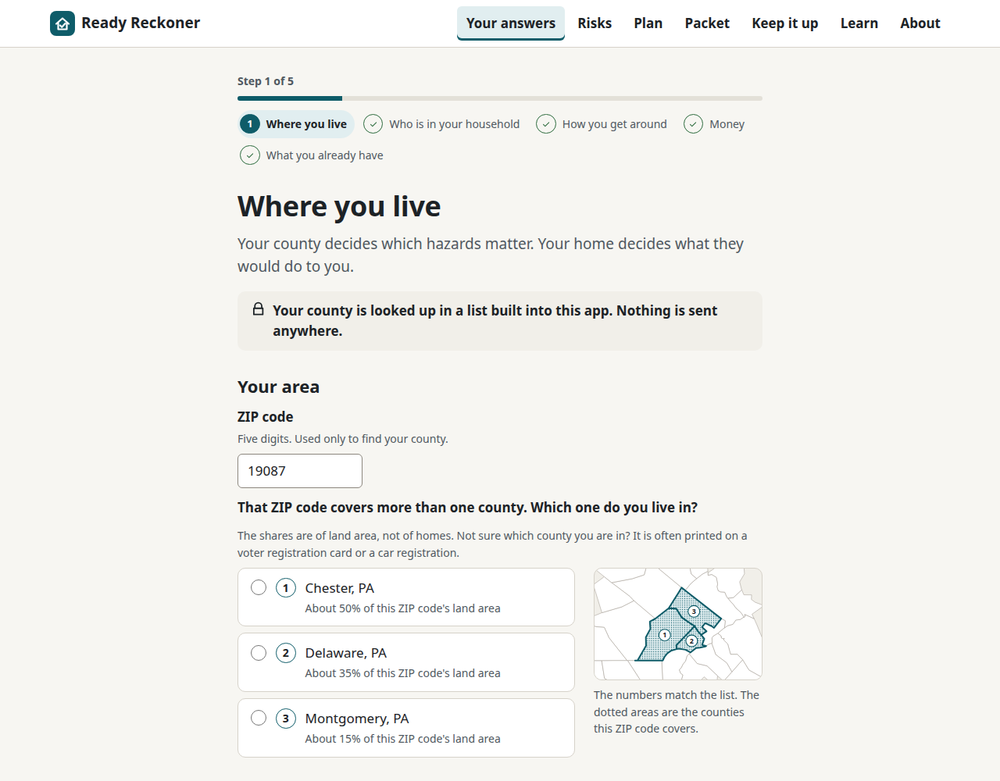
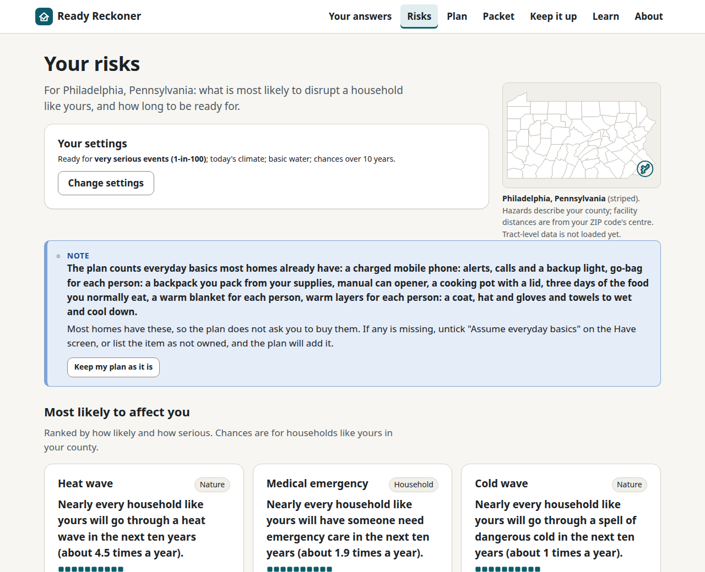
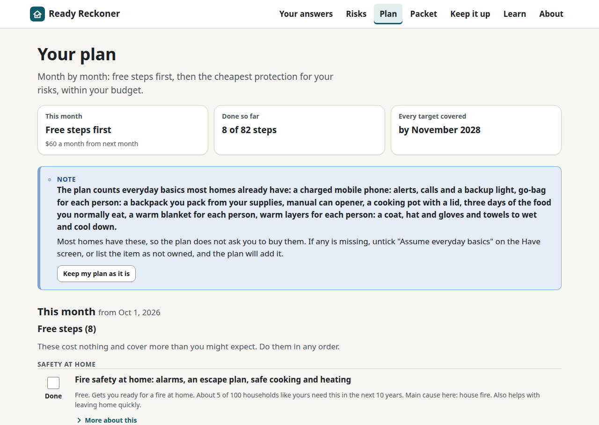
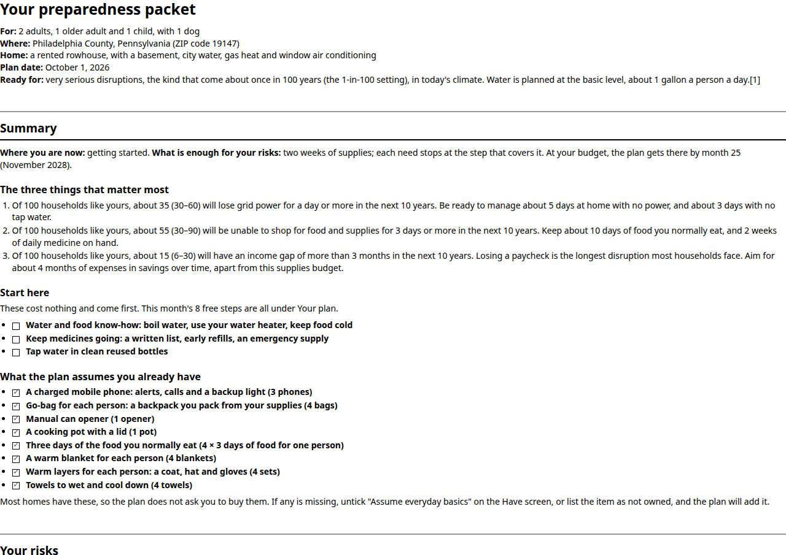
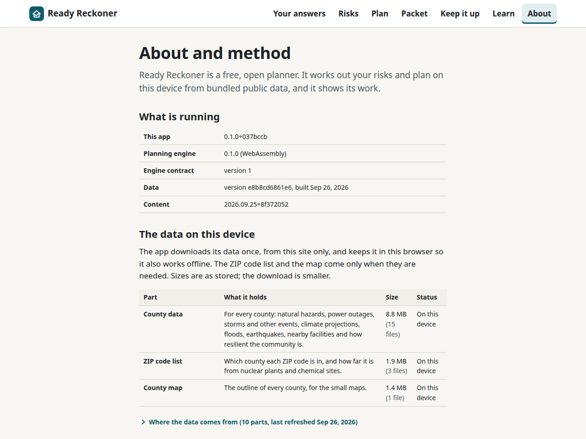

# Ready Reckoner

**A disaster-preparedness planner that tells you what is actually likely to happen where you
live, what it would do to your household, and what to buy first with the money you have.**

Enter your location and a few facts about your household. Ready Reckoner works out, from public
hazard data and cited research, which emergencies you should plan for, how many days you should be
able to manage without power, water, income or help, and what to do about it in what order: a
72-hour kit and a get-home bag first, then two weeks, then a month, and only as far beyond that as
your risk justifies. It hands you a printable packet you can keep in a drawer.

It exists so that nobody prepares for a nuclear war and gets caught out by a pandemic, a week-long
ice storm, or a lost job.

## What makes it different

- **It plans by consequence, not by hazard.** You don't prepare for a hurricane; you prepare for ten
  days without power. Every hazard where you live maps onto a handful of consequences (no power, no
  safe water, can't leave home, must leave home, no income, no medical help, no communications), and
  the plan is sized against those. The same two weeks of water covers the hurricane, the pandemic and
  the water-main break. Hazard-specific extras (a gas shut-off wrench, N95 masks, a staged go-bag)
  ride on top.
- **Every number has a source.** Water per person per day, calories, medication supply, outage
  durations, event frequencies: each traces to FEMA, NOAA, USGS, the CDC, the Sphere Handbook or the
  peer-reviewed literature, and you can see which.
- **It respects your budget.** Tell it what you can spend per month. It orders purchases by risk
  reduced per dollar, starting with the things that cost nothing (documents, a plan, water in bottles
  you already own, knowing your neighbours), and it tells you when you have done enough.
- **It is honest about likelihood.** Risks are shown as natural frequencies ("of 100 households like
  yours, about 12 will face a week without power in the next ten years"), as ranges, with a dial for
  how rare an event you want to be ready for.
- **Nothing leaves your computer.** It is a static website that works offline. There is no server,
  no account, no analytics. Your address and your family's medical details stay in your browser.
- **Specs, not brands.** Each item says what to look for, what to avoid, and a typical price range.
  It never links to a store.

## Who it is for

Anyone starting from nothing who wants a professional's judgement without hiring one, and
experienced preparers who want the assumptions exposed and adjustable. The guided interview produces
the plan; every dial behind it is there if you want it.

## Status

**v0.1.0 (September 2026): working end to end on national data.** The engine, the website and the
printable packet all work together, for every county in the country. See
[docs/DESIGN.md](docs/DESIGN.md) for the design, [docs/ROADMAP.md](docs/ROADMAP.md) for what's built
and what's next, [CHANGELOG.md](CHANGELOG.md) for what shipped in this version, and the GitHub
issues for the day-to-day work list.

## Try it

The live site: **<https://holdthedoorhoid.github.io/ready-reckoner/>**. It works on a phone or a
computer. Once it has loaded once, it keeps working without a connection.

A 60-second walkthrough:

1. **Start.** Choose "Start new" (or open a saved plan, if you have one — nothing is required to
   begin).
2. **Where you live.** Enter a ZIP code or a county. The lookup runs on your device; nothing is sent
   anywhere. A ZIP code that covers more than one county shows each one's share, with a map, so you
   can pick the right one.
3. **A few questions.** Who is in your household, how you get around, your budget, and what you
   already have. Skip anything you're unsure of — you can change it later.
4. **Your risks.** See what is actually likely to affect your household, ranked, with the number of
   days you should be ready for and why, and a source behind every figure.
5. **Your plan.** A month-by-month list, free steps first, sized to your budget, that tells you when
   you've done enough.
6. **Your packet.** Everything above, laid out to print in black and white and keep in a drawer.

|  |  |
| --- | --- |
|  |  |
| *Where you live: an ambiguous ZIP code, resolved with a map.* | *Your risks: ranked, with a source behind every number.* |
|  |  |
| *Your plan: free steps first, month by month.* | *Your packet: ready to print and keep in a drawer.* |

*About and method: every version, and exactly what data is on your device.*

## How the numbers are made

Where you live gives each hazard a yearly chance; who you are changes what those hazards would do to
you. Each hazard that hits turns into a few plain consequences (no power, no water, stuck at home,
must leave, no income, no help, no phone) that last some number of days. Adding up all the hazards
tells us, for each consequence, how many days you should be ready for if you want to be covered in,
say, nine out of ten ten-year stretches. Those days, times your household, become quantities of
water, food, medicine, fuel and paperwork, each with its source. Your budget then buys the cheapest
risk reduction first, month by month, until each consequence is covered and the app tells you to
stop.

Read more: the hazard math in [docs/RISK_MODEL.md](docs/RISK_MODEL.md), the sizing rules in
[docs/QUANTITY_RULES.md](docs/QUANTITY_RULES.md), where the data comes from in
[docs/DATA_SOURCES.md](docs/DATA_SOURCES.md), and the independent check run against all of it in
[docs/VERIFICATION.md](docs/VERIFICATION.md).

## What it is not

- **Not medical, legal or financial advice.** Ready Reckoner summarises published guidance and
  public data. It is not a substitute for a prescriber, an insurer, an attorney or your local
  emergency management agency. Where it touches medication, it tells you to talk to a prescriber;
  where it touches insurance, it tells you what to ask. It never tells you which drug to take for
  which condition.
- **United States only.** The hazard data, the outage records and the household assumptions are all
  built for the US. A location outside the US will not resolve.
- **County-level, not address-level.** Hazard numbers describe your county (facility distances use
  the centre of your ZIP code instead), not your exact street. Two households a few miles apart, on
  either side of a county line, can see different numbers for what is really the same risk.
- **Sample counties if the real data can't load.** The full national data pack has to download
  before the site can plan for your actual county. If that fails — no connection on a first visit,
  for example — the site says so plainly and can only plan using a handful of built-in sample
  counties, rather than silently guessing at real numbers.

## Privacy

Nothing you enter — your location, your household, your budget — leaves your browser. There is no
server, no account and no analytics. See [docs/PRIVACY.md](docs/PRIVACY.md) for exactly what is
stored on your device, what the site downloads and why, what the site's host can and can't see, and
how to check all of it yourself.

## Repository layout

| Path | What |
| --- | --- |
| `crates/` | The Rust engine: hazards, consequences, supply sizing, budget allocation, plan and packet generation, plus the CLI, the WebAssembly bindings and the data pipeline |
| `web/` | The website (Svelte + TypeScript), which runs the engine in the browser |
| `data/` | Built data packs and their provenance manifest (raw downloads are never committed) |
| `content/` | The guidance text and item catalogue (CC BY-SA 4.0) |
| `fixtures/` | Fixture households and golden plans used by the tests |
| `docs/` | Design, risk model, data sources, content standards, UI, roadmap, research, screenshots |

## Built with

Rust, compiled to WebAssembly, for the planning engine. Svelte and TypeScript for the website. A
static site, deployed on GitHub Pages.

## Contributing

Contributions are welcome. [CONTRIBUTING.md](CONTRIBUTING.md) has the ground rules: cite every
number, specs instead of brands, consequences before causes, and plain language throughout. Open an
issue before starting anything larger than a small fix.

## Licence

Code is licensed under the GNU General Public License v3.0 ([LICENSE](LICENSE)). The written
guidance, item catalogue and derived tables under `content/` and `docs/` are licensed under Creative
Commons Attribution-ShareAlike 4.0 ([LICENSE-CONTENT](LICENSE-CONTENT)). Federal data and text
incorporated from United States government sources are in the public domain; their provenance is
recorded in `data/manifest.json` and inline citations.
